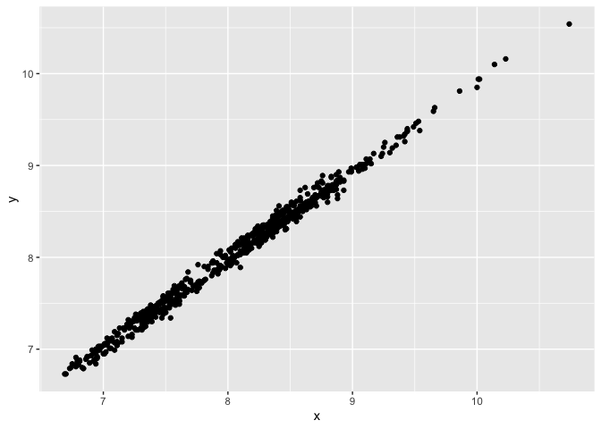
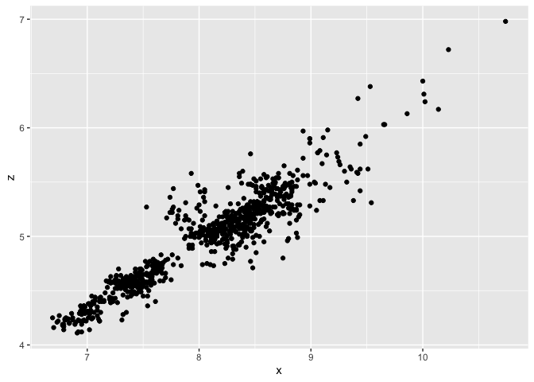

Homework 5
================
Ethan Sweet
09/17/2021

## Part 1 - Counts of Cut in Diamonds

``` r
cut_type <- filter (diamonds, cut=="Ideal")
cut_type <- as.data.frame(cut_type)

count(cut_type)
```

    ##       n
    ## 1 21551

## Part 2 - Avg. Size of 100 Largest Diamonds

``` r
avg_size <- diamonds %>%
  group_by(clarity) %>%
  slice_max(order_by=carat, n=100, with_ties = FALSE)
avg_size
```

    ## # A tibble: 800 × 10
    ## # Groups:   clarity [8]
    ##    carat cut       color clarity depth table price     x     y     z
    ##    <dbl> <ord>     <ord> <ord>   <dbl> <dbl> <int> <dbl> <dbl> <dbl>
    ##  1  5.01 Fair      J     I1       65.5    59 18018 10.7  10.5   6.98
    ##  2  4.5  Fair      J     I1       65.8    58 18531 10.2  10.2   6.72
    ##  3  4.13 Fair      H     I1       64.8    61 17329 10     9.85  6.43
    ##  4  4.01 Premium   I     I1       61      61 15223 10.1  10.1   6.17
    ##  5  4.01 Premium   J     I1       62.5    62 15223 10.0   9.94  6.24
    ##  6  4    Very Good I     I1       63.3    58 15984 10.0   9.94  6.31
    ##  7  3.67 Premium   I     I1       62.4    56 16193  9.86  9.81  6.13
    ##  8  3.65 Fair      H     I1       67.1    53 11668  9.53  9.48  6.38
    ##  9  3.5  Ideal     H     I1       62.8    57 12587  9.65  9.59  6.03
    ## 10  3.4  Fair      D     I1       66.8    52 15964  9.42  9.34  6.27
    ## # … with 790 more rows

### Scatter for Plots Part 2

``` r
ggplot(data = avg_size) +
  geom_point(mapping = aes(x = x, y = y)) # plot of x vs y
```

<!-- -->

``` r
avg_size_filt <- filter (avg_size, z > 2)
ggplot(data = avg_size_filt) +
  geom_point(mapping = aes(x = x, y = z)) # plot of filtered x vs z 
```

<!-- -->
