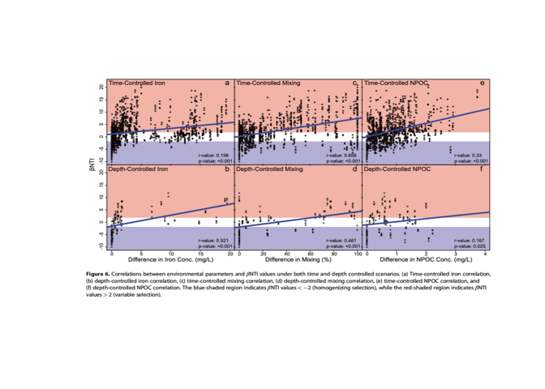
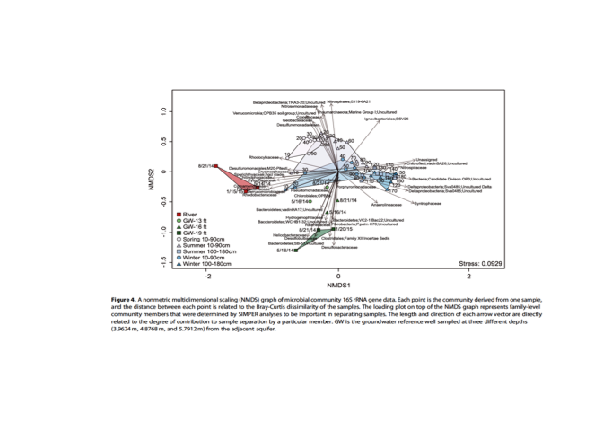

Homework 6
================
Ethan Sweet
09/23/2021

# Preface

I chose two (2) plots from the same paper. One that is successful in
communicating the data presented in the research and one that I think is
unsuccessful. I’ve also included another plot I think is unsuccessful
that is my own.

These plots are from a 2016 paper called *Seasonal hyporheic dynamics
controlcoupled microbiology and geochemistry in Colorado River
sediments*

Citation:

Danczak, Robert E., Sawyer, Audrey H., Williams, Kenneth H., Stegen,
James C., Hobson, Chad, & Wilkins, Michael J.. Seasonal hyporheic
dynamics control coupled microbiology and geochemistry in Colorado River
sediments. United States. <https://doi.org/10.1002/2016JG003527>

## Evaluation of Successful Plot

``` r
# Loading in Good Plot 
goodplot <- readPNG("goodplot1.png")
plot.new() 
rasterImage(goodplot,0,0,1,1)
```

<!-- -->

The graph I want to highlight is represents spatiotemporal distribution
of microbial communities in relation to some geochemical parameters as
well. What I like about it is that it has two clearly defined regions.
The highly variable region (red) and the homogenizing region (blue). The
point of this graph is to communitate that microbial communities at this
hyporheic interface are very similar across the timepoints in which the
data was collected, which may indicate little variability in
hydrological/geochemical parameters from the river. Moreover, these
nearly constant parameters would then likely be the strongest controls
on the resulting community compositions. In regards to Tufte’s concepts,
I think that it shows comparison and causality well, by linking the
spatiotemporal and microbial community data with geochemical and
inferred hydrological data (without direcly having to observe it).
Furthermore, it uses multivariate data, and focus on the data without
adding a lot of other junk that the eye focuses on. The data itself is
continuous data that has been normalized with a BNTI values
(standardized effect size of β-MNTD, which indicates how much the
observed difference between a pair of communities differs from a null
distribution of β-MNTD calculated with randomized phylogenetic
relationships). The plot would use geometries of point and line, the
points representing the datapoints themselves and the line representing
the r-value relationship between the datapoints.

## Evaluation of Unsuccessful Plot

``` r
# Loading in Bad Plot 
goodplot <- readPNG("badplot1.png")
plot.new() 
rasterImage(goodplot,0,0,1,1)
```

<!-- -->

The second plot I want to highlight may be effective in communicating
its data to other people, but I personally don’t like the way its
presented. The plit is from the same paper as the first (good) plot,
however I think it falls short of communicating the data properly.
Firstly, ther is a lot of noise within the plot itself (a nonmetric
multidimensional scaling (NMDS) graph), while this is mostly due to that
large amount of information being presented in the plot, it is still
overwhelming. Secondly, the colors used between summer and winter
seasons look really similar unless you really zoom in or have great
eyesight, which can definitely misconstrue the data. Another thing I
dont like about this paper is that the distance between the points
correlates to the Bray-Curtis dissimilarity of the samples, but that is
not communicated very well in the graph or outside of the explantion in
the description. There is too much text on the plot in general, and most
of it overlaps making it very difficult to read and overwhelming to look
at. I think the plot is mostly bad but is ugly too. I think that it is
unclear, confusing, and a little overly complicated. Regarding Tufte’s
principles, It does do some things well, it show multivariate data and
comparisons but it doesn’t integrate other components that I think could
explain the plot visually to someone at least like me. I think to
improve this plot, weights need to be given to position order on the
different names/variables in the plot so they don’t overlap with one
another so much (like jittering datapoints).Moreover, I think
