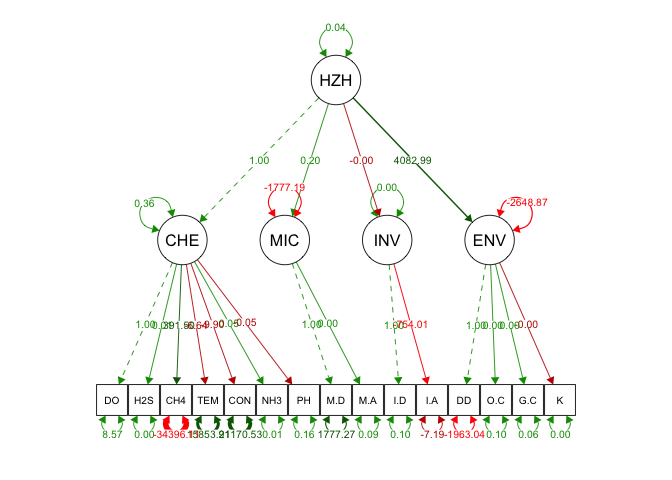
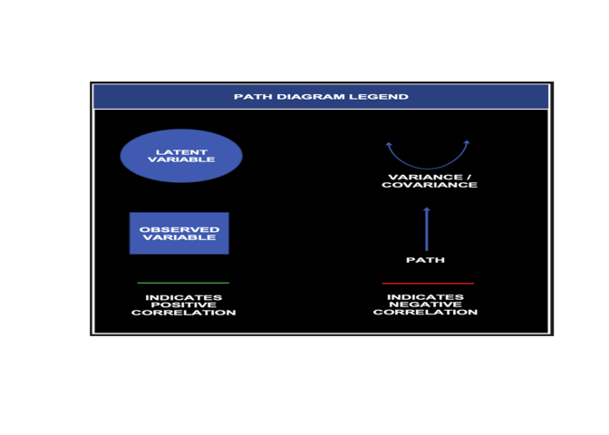
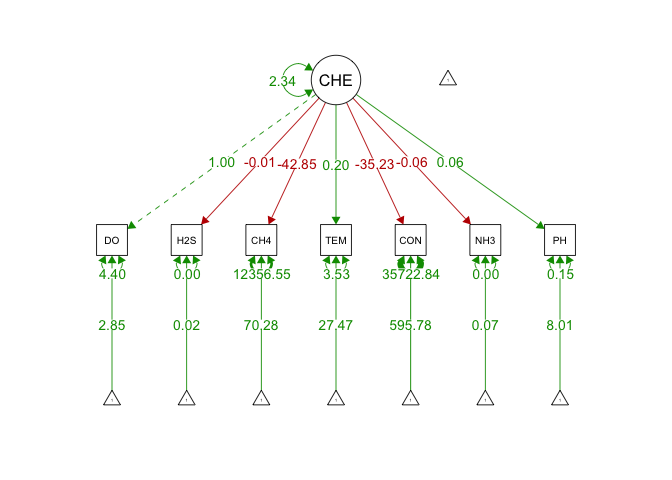

MICR 575 Final Project: Srtuctural Equation Models
================

# Introduction:

Below are a series of predictive models known as structural equation
models, or SEM(s) for short. These models analyze how observable
variables (variables we can directly measure in reality) correlate with
variables that cannot be directly measured (latent variables), which, in
this instance, are hyporheic zone health which is a combination of
geochemical conditions , environmental conditions, microbial
populations, and invertebrate populations. The hyporheic zone (HZ) is an
ecotone within riparian systems where substantial mixing of surface
water and groundwater occurs across fluctuating (hydro)geological,
biological, and atmospheric boundaries (Bencala, 2000; Boulton et al.,
2010; Ye et al., 2012). The HZ is an important habitat for microbes,
lotic macroinvertebrates, and groundwater invertebrates, as well as
larger organisms at higher trophic levels (Holmes, 2000). As much as
90%–98% of biogeochemical processing within a watershed occurs within
the riparian zone, or the interface between aquatic and terrestrial
habitats, which is dominated by the hyporheic zone. The models in this
project utilize structural equation modeling within the “lavaan” package
to produce path analysis plots which are an examination of the direction
and magnitude of the relationship between variables. Structural equation
models are used in a variety of modeling situations when typical
regression models may not be sufficient. It must be noted, however, that
the user must use caution when interpreting SEM results as the model
conditions and convergences may not be adequate for causation (Beran &
Violato, 2010). These relationships have the potential to reveal hidden
processes/relationships between the many variables considered in my
research.

*References:*

-   Bencala K, Walters R (1983). Simulation of Solute Transport in a
    Mountain Pool-and-Riffle Stream: A Transient Storage Model. Water
    Resources Research - WATER RESOUR RES 19: 718-724.

-   Beran, T.N., Violato, C. Structural equation modeling in medical
    research: a primer. BMC Res Notes 3, 267 (2010).
    <https://doi.org/10.1186/1756-0500-3-267>

-   Boulton AJ, Datry T, Kasahara T, Mutz M, Stanford JA (2010). Ecology
    and management of the hyporheic zone: stream–groundwater
    interactions of running waters and their floodplains. Journal of the
    North American Benthological Society 29: 26-40.

-   Holmes R (2000). The Importance of Ground Water to Stream Ecosystem
    Function. pp 137-148.

-   Ye S, Covino TP, Sivapalan M, Basu NB, Li H-Y, Wang S-W (2012).
    Dissolved nutrient retention dynamics in river networks: A modeling
    investigation of transient flows and scale effects. Water Resources
    Research 48.

For more information on SEM’s and Lavaan follow these links:

Lavaan package (<https://lavaan.ugent.be/>) Sem package
(<https://cran.r-project.org/web/packages/sem/sem.pdf>)

``` r
library(lavaan)  #for performing the analyses
```

    ## This is lavaan 0.6-9
    ## lavaan is FREE software! Please report any bugs.

``` r
library(semPlot)  #for plotting your analyses
library(dplyr)  #for subsetting data 
```

    ## 
    ## Attaching package: 'dplyr'

    ## The following objects are masked from 'package:stats':
    ## 
    ##     filter, lag

    ## The following objects are masked from 'package:base':
    ## 
    ##     intersect, setdiff, setequal, union

``` r
library(png) #for displaying .png files
semcsv=read.csv('sem_final.csv')
```

``` r
head(semcsv)  #view data file to confirm what data is pulled in
```

    ##    DD  BR   PH   DO  TEMP   COND    CH4 NH3N     H2S M.Diversity M.Abundance
    ## 1 224 BR1 7.70 3.00 24.59 1323.0   1.35 0.09 0.02463   0.2650711  0.80573885
    ## 2 224 BR2 7.93 1.43 24.84 1373.0     NA 0.16 0.04560   0.5171316  0.31887286
    ## 3 224 BR3 7.89 0.06 24.66 1244.0  11.45 0.05 0.02243   0.7765444  0.01074566
    ## 4 224 BR4 8.25 0.10 26.65  957.9 109.18 0.38 0.08021   0.9488557  0.34089680
    ## 5 224 BR5 8.13 0.10 24.27 1286.0     NA 0.15 0.03196   0.9583338  0.78429769
    ## 6 224  SW 8.33 5.38 27.17  868.1  10.61 0.01 0.00660   0.2725659  0.87033200
    ##   I.Diversity I.Abundance O.Cond   G.Cond           K
    ## 1   0.6073404   0.9098590    ALL DOLOMITE 0.008375072
    ## 2   0.5475949   0.4035795    ALL DOLOMITE 0.005253269
    ## 3   0.2171716   0.2661032    ALL DOLOMITE 0.008512150
    ## 4   0.9232289   0.5307422    ALL DOLOMITE 0.007182200
    ## 5   0.8774066   0.5029544    ALL DOLOMITE 0.000602642
    ## 6   0.1719422   0.4168736    ALL DOLOMITE 0.001515267

# Structural Regression Model

``` r
#First step is creating the sem model with latent variables
#Second step is creating predictor variables by regression of latent variables

sem.model.measurement <- "CHEM =~ 1*DO + H2S + CH4 + TEMP + COND + NH3N + PH
#make indicator latent environmental health with observable geochemical factors and DO as marker

MIC =~ 1* M.Diversity + M.Abundance
#make indicator latent microbial health factor with biomass and prokaryote diversity as the marker

INV =~ 1* I.Diversity + I.Abundance
#make indicator latent invertibrate abundance (counts) and diversity variable as the marker

ENV =~ 1* DD + O.Cond + G.Cond + K
#make indicator latent environmental health factor with overburden conditions, geological conditions, hydraulic conductivity, with downstream distance variable as the marker

HZHEALTH =~ CHEM + MIC + INV + ENV" 

sem.fit.measurement <- sem(sem.model.measurement, data = semcsv)
```

    ## Warning in lav_data_full(data = data, group = group, cluster = cluster, : lavaan
    ## WARNING: some observed variances are (at least) a factor 1000 times larger than
    ## others; use varTable(fit) to investigate

    ## Warning in lavaan::lavaan(model = sem.model.measurement, data = semcsv, : lavaan WARNING:
    ##     the optimizer (NLMINB) claimed the model converged, but not all
    ##     elements of the gradient are (near) zero; the optimizer may not
    ##     have found a local solution use check.gradient = FALSE to skip
    ##     this check.

``` r
summary(sem.fit.measurement, fit.measures = TRUE)
```

    ## lavaan 0.6-9 did NOT end normally after 3760 iterations
    ## ** WARNING ** Estimates below are most likely unreliable
    ## 
    ##   Estimator                                         ML
    ##   Optimization method                           NLMINB
    ##   Number of model parameters                        34
    ##                                                       
    ##                                                   Used       Total
    ##   Number of observations                            40          57
    ##                                                                   
    ## Model Test User Model:
    ##                                                       
    ##   Test statistic                                    NA
    ##   Degrees of freedom                                NA

    ## Warning in .local(object, ...): lavaan WARNING: fit measures not available if model did not converge

    ## 
    ## Parameter Estimates:
    ## 
    ##   Standard errors                             Standard
    ##   Information                                 Expected
    ##   Information saturated (h1) model          Structured
    ## 
    ## Latent Variables:
    ##                    Estimate    Std.Err  z-value  P(>|z|)
    ##   CHEM =~                                               
    ##     DO                  1.000                           
    ##     H2S                 0.008       NA                  
    ##     CH4               391.501       NA                  
    ##     TEMP               -6.639       NA                  
    ##     COND               -9.898       NA                  
    ##     NH3N                0.046       NA                  
    ##     PH                 -0.054       NA                  
    ##   MIC =~                                                
    ##     M.Diversity         1.000                           
    ##     M.Abundance         0.000       NA                  
    ##   INV =~                                                
    ##     I.Diversity         1.000                           
    ##     I.Abundance      -754.006       NA                  
    ##   ENV =~                                                
    ##     DD                  1.000                           
    ##     O.Cond              0.000       NA                  
    ##     G.Cond              0.001       NA                  
    ##     K                  -0.000       NA                  
    ##   HZHEALTH =~                                           
    ##     CHEM                1.000                           
    ##     MIC                 0.202       NA                  
    ##     INV                -0.000       NA                  
    ##     ENV              4082.990       NA                  
    ## 
    ## Variances:
    ##                    Estimate    Std.Err  z-value  P(>|z|)
    ##    .DO                  8.571       NA                  
    ##    .H2S                 0.000       NA                  
    ##    .CH4            -34396.110       NA                  
    ##    .TEMP            15853.907       NA                  
    ##    .COND            21170.531       NA                  
    ##    .NH3N                0.008       NA                  
    ##    .PH                  0.155       NA                  
    ##    .M.Diversity      1777.274       NA                  
    ##    .M.Abundance         0.087       NA                  
    ##    .I.Diversity         0.105       NA                  
    ##    .I.Abundance        -7.191       NA                  
    ##    .DD              -1963.044       NA                  
    ##    .O.Cond              0.098       NA                  
    ##    .G.Cond              0.059       NA                  
    ##    .K                   0.000       NA                  
    ##    .CHEM                0.361       NA                  
    ##    .MIC             -1777.187       NA                  
    ##    .INV                 0.000       NA                  
    ##    .ENV             -2648.865       NA                  
    ##     HZHEALTH            0.037       NA

``` r
semPaths(sem.fit.measurement, "par", edge.label.cex = .75, edge.label.position= .5, fade = FALSE, layout="tree3", intercepts = TRUE, residuals = TRUE, thresholds = TRUE, intStyle = "multi", combineGroups = TRUE)
```

<!-- -->

``` r
#plot the CFA. you can change layout with layout = argument. see ?semPaths() for more. 
```

``` r
#Key for SEM Path Diagrams

library("png")
pd <- readPNG("PathDiagram.png", native = TRUE)
plot.new() 
rasterImage(pd,0,0,1,1)
```

<!-- -->

# Exogenous Model

``` r
exmodel <- 'CHEM =~ 1*DO + H2S + CH4 + TEMP + COND + NH3N + PH
#intercepts (nu = tau) 

#Specify parameters on observed variables
DO ~ 1
H2S ~ 1 
CH4 ~ 1
TEMP ~1 
COND ~ 1
NH3N ~ 1
PH ~ 1'

Fitexmodel <- sem(exmodel, data=semcsv) 
```

    ## Warning in lav_data_full(data = data, group = group, cluster = cluster, : lavaan
    ## WARNING: some observed variances are (at least) a factor 1000 times larger than
    ## others; use varTable(fit) to investigate

    ## Warning in lav_model_vcov(lavmodel = lavmodel, lavsamplestats = lavsamplestats, : lavaan WARNING:
    ##     Could not compute standard errors! The information matrix could
    ##     not be inverted. This may be a symptom that the model is not
    ##     identified.

``` r
summary(Fitexmodel, standardized=TRUE)
```

    ## lavaan 0.6-9 ended normally after 88 iterations
    ## 
    ##   Estimator                                         ML
    ##   Optimization method                           NLMINB
    ##   Number of model parameters                        21
    ##                                                       
    ##                                                   Used       Total
    ##   Number of observations                            40          57
    ##                                                                   
    ## Model Test User Model:
    ##                                                       
    ##   Test statistic                                43.473
    ##   Degrees of freedom                                14
    ##   P-value (Chi-square)                           0.000
    ## 
    ## Parameter Estimates:
    ## 
    ##   Standard errors                             Standard
    ##   Information                                 Expected
    ##   Information saturated (h1) model          Structured
    ## 
    ## Latent Variables:
    ##                    Estimate   Std.Err  z-value  P(>|z|)   Std.lv   Std.all
    ##   CHEM =~                                                                 
    ##     DO                 1.000                                1.531    0.590
    ##     H2S               -0.012       NA                      -0.019   -0.953
    ##     CH4              -42.850       NA                     -65.601   -0.508
    ##     TEMP               0.197       NA                       0.302    0.159
    ##     COND             -35.226       NA                     -53.929   -0.274
    ##     NH3N              -0.058       NA                      -0.090   -0.983
    ##     PH                 0.062       NA                       0.095    0.241
    ## 
    ## Intercepts:
    ##                    Estimate   Std.Err  z-value  P(>|z|)   Std.lv   Std.all
    ##    .DO                 2.852       NA                       2.852    1.099
    ##    .H2S                0.019       NA                       0.019    0.964
    ##    .CH4               70.275       NA                      70.275    0.544
    ##    .TEMP              27.466       NA                      27.466   14.431
    ##    .COND             595.775       NA                     595.775    3.031
    ##    .NH3N               0.072       NA                       0.072    0.788
    ##    .PH                 8.006       NA                       8.006   20.261
    ##     CHEM               0.000                                0.000    0.000
    ## 
    ## Variances:
    ##                    Estimate   Std.Err  z-value  P(>|z|)   Std.lv   Std.all
    ##    .DO                 4.396       NA                       4.396    0.652
    ##    .H2S                0.000       NA                       0.000    0.092
    ##    .CH4            12356.554       NA                   12356.554    0.742
    ##    .TEMP               3.531       NA                       3.531    0.975
    ##    .COND           35722.835       NA                   35722.835    0.925
    ##    .NH3N               0.000       NA                       0.000    0.034
    ##    .PH                 0.147       NA                       0.147    0.942
    ##     CHEM               2.344       NA                       1.000    1.000

``` r
semPaths(Fitexmodel, "par", edge.label.cex = 1, edge.label.position= .5, fade = FALSE)
```

<!-- -->

# Conclusion

Although the analyses were completed I received the following warnings
from lavaan:

lav\_data\_full(data = data, group = group, cluster = cluster, : lavaan
WARNING: some observed variances are (at least) a factor 1000 times
larger than others; use varTable(fit) to investigate

Warning in lav\_model\_vcov(lavmodel = lavmodel, lavsamplestats =
lavsamplestats, : lavaan WARNING: Could not compute standard errors! The
information matrix could not be inverted. This may be a symptom that the
model is not identified.

This may indicate that data clean up needs to occur, since the variances
are very high in the observable variables. However, some of the data
pulled into these models is not “real” data, instead it is dummy data
randomly generated and entered into the model. Data for these models may
need to be normalized (z-score) prior to utilizing the SEM(s).
