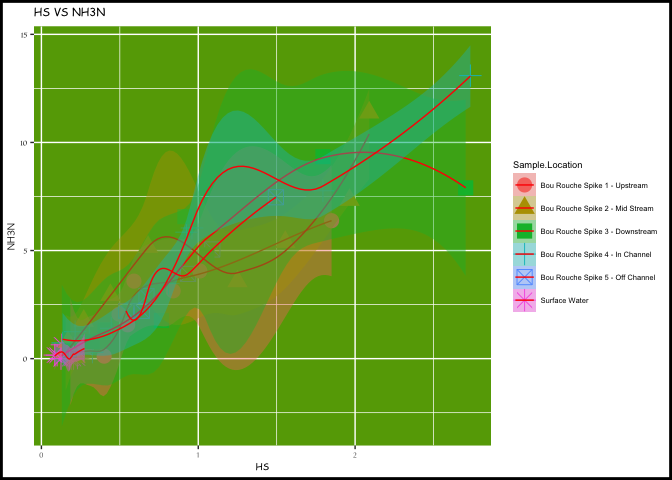
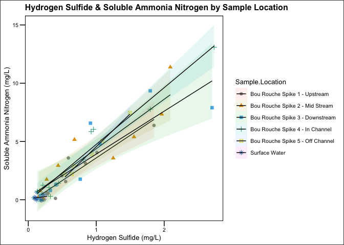

Assignment: BADPLOT!
================
Ethan Sweet
10/04/2020

# BADPLOT

This plot is bad for **multiple** reasons. In general, it is just
straight up unpleasant to look at. Below are a list of *specific*
reasons why this plot is a violation to data scientists:

-   The color scheme is awful, extremely difficult to see the data
    points, and the combination of red and green make it difficult for
    those who may be red-green colorblind to see it (as if is wasn’t
    already hard enough). There is also a lot of data on the graph,
    making it visually hard to distinguish the data, the concept of
    hyperactive design indicated (Tufte, pg 67). For this graph to
    maintain its graphical integretiy, there needs to be context (Tufte,
    74), which is difficult to interpret from this graph as the labels
    are vauge and it is difficult to even tell what is being displayed.

-   The data axes are labeled with chemical formulas (and poorly written
    at that) giving the reader an unclear idea of exactly what they are
    looking at. Moreover, there are no units on the axes, so it is
    unknown wether or not the variables are even comparable on the same
    scale.

-   Each trend fit for the data series is different (auto setting for
    geom\_smooth) despite sharing a common dataset, giving the
    impression that there are different order relationships between the
    same overall group of data. This also creates a multitude of
    warnings and bullsh\*t values for the trendlines

-   The font is too small for the size of the graph, and there are
    multiple font types on the plot, additionally making it
    aesthetically unpleasing.

``` r
ggplot(bad, aes(x=HS,y=NH3N, fill=Sample.Location)) +
  
  geom_point(size = 5, na.rm=TRUE, aes(color=Sample.Location, shape=Sample.Location)) + geom_smooth(method = "auto", colour="red", size=0.5) + 
  theme(panel.background = element_rect(fill = "#65A603"), text = element_text(size = 7), 
        
        plot.title = element_text(family = "Comic Sans MS"), 
        axis.title.x  = element_text(family = "Comic Sans MS"),
        axis.title.y  = element_text(family = "AppleGothic"),
        axis.text.x   = element_text(family = "Optima"),
        axis.text.y   = element_text(family = "Luminari")) + 
  
  theme(plot.background = element_rect(color = "black", size = 2)) + ggtitle("HS VS NH3N")   
```

    ## `geom_smooth()` using method = 'loess' and formula 'y ~ x'

    ## Warning in simpleLoess(y, x, w, span, degree = degree, parametric =
    ## parametric, : Chernobyl! trL>n 6

    ## Warning in simpleLoess(y, x, w, span, degree = degree, parametric =
    ## parametric, : Chernobyl! trL>n 6

    ## Warning in sqrt(sum.squares/one.delta): NaNs produced

    ## Warning in stats::qt(level/2 + 0.5, pred$df): NaNs produced

    ## Warning in max(ids, na.rm = TRUE): no non-missing arguments to max; returning
    ## -Inf

<!-- -->

# GOOD(ISH)PLOT

This is a better version of BADPLOT, but it is not great honestly. I did
not spend too much time on perfecting it, but it is *much* better than
BADPLOT.

``` r
# GOODPLOT


cbp1 <- c("#999999", "#E69F00", "#56B4E9", "#009E73",
          "#F0E442", "#0072B2", "#D55E00", "#CC79A7")

ggplot(good, aes(x=HS,y=NH3N, fill=Sample.Location)) +
  geom_point(size = 2, na.rm=TRUE, aes(color=Sample.Location, shape=Sample.Location )) + scale_colour_manual(values=cbp1) + theme_base() +
  theme(legend.position = "right", text = element_text(size = 10)) + stat_smooth(method = "lm", colour="black", size=0.5, alpha = 0.1) + ggtitle("Hydrogen Sulfide & Soluble Ammonia Nitrogen by Sample Location") + xlab("Hydrogen Sulfide (mg/L)") + ylab("Soluble Ammonia Nitrogen (mg/L)") 
```

    ## `geom_smooth()` using formula 'y ~ x'

<!-- -->

``` r
#facet_wrap(~Sample.Location) Also this may be a good way to visualize all of the groups individually while letting you compare them somewhat.I couldn't get the trend lines to label individually with different colors so you could better tell them apart with their R^2 values but, that is what I am going for. 
```
